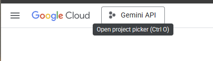
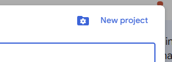
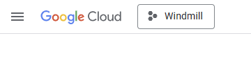
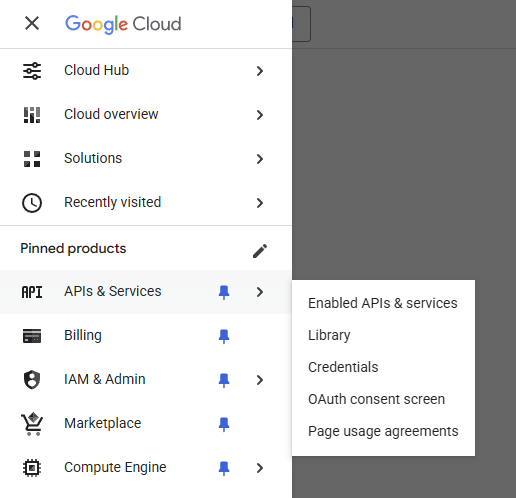
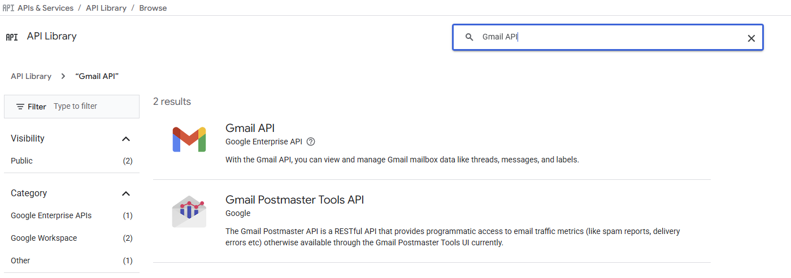
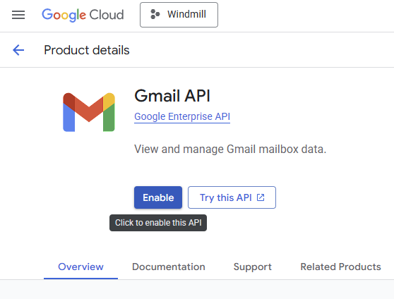
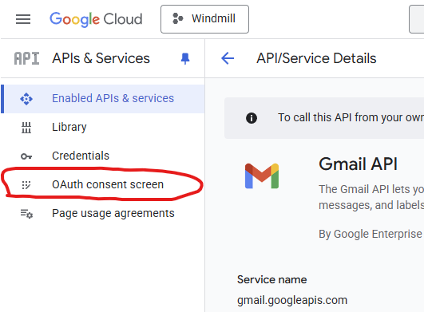
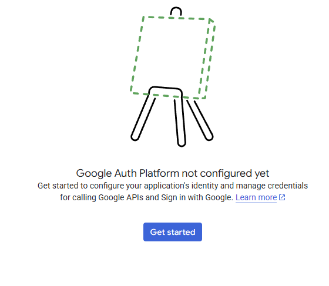
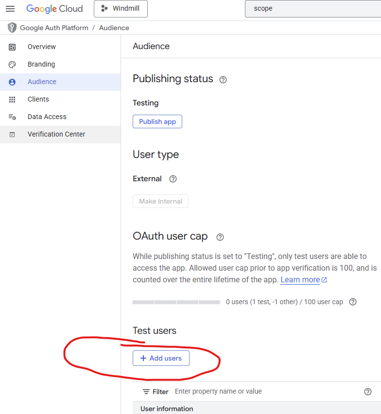
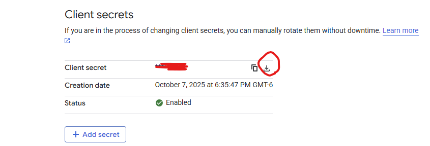

# Gmail

Grants Decree read-only access to your Gmail inbox via OAuth 2.0. Once configured, the `gmail-sync` automation is enabled automatically and credentials are loaded by the container at runtime.

## Setup

```bash
./existential.sh setup gmail
```

The script will:

1. Prompt for your Google Cloud Client ID and Client Secret
2. Print an authorization URL — open it in your browser
3. After you authorize, your browser redirects to `http://localhost:8803?code=...` and shows a connection error — that's expected
4. Copy the full URL from the address bar and paste it back into the terminal

Credentials are saved to `services/decree/secrets/gmail/credentials.env` and the `gmail-sync` routine is enabled in `automations/config.yml` automatically.

## Google Cloud Setup

You'll need a Client ID and Client Secret from Google Cloud Console before running the setup script. Go to [console.cloud.google.com](https://console.cloud.google.com/) to get started.

### 1. Create or Select a Project

Select an existing project or create a new one.





Make sure the new project is selected before continuing.



### 2. Enable the Gmail API

Go to **APIs & Services → Library**.



Search for **Gmail API**.



Click **Enable**.



### 3. Configure the OAuth Consent Screen

Go to the **OAuth consent screen**.



Click **Get started**.



- Set the app to **External**
- Fill in the app name and your email

### 4. Add Yourself as a Test User

While the app is in testing mode, only explicitly added users can authorize it. Go to **OAuth consent screen → Test users → Add users** and add your email.



### 5. Create OAuth Client ID

Go to **APIs & Services → Credentials → Create Credentials → OAuth Client ID**.

- Application type: **Desktop app**
- Add redirect URI: `http://localhost:8803`

Note your **Client ID** and **Client Secret** — you'll paste these into the setup script.


