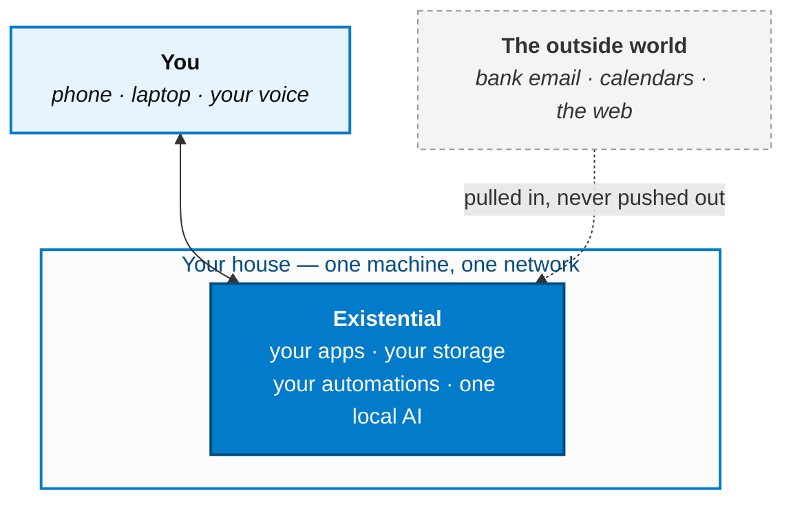

# What It Is

:::info[Level 1 of 4 · Context]
The system as one box — what it is and what it does for you. Zoom in one step at
[Level 2 · The Pieces](./how-it-works).
:::

Whatever you need done digitally, open source can do it. Notes, photos, money,
files, recipes, dashboards, monitoring, home automation — there is a good, free, actively
maintained project for nearly all of it.

The hard part was never finding the software. The hard part is running twenty of them at
once: giving each one a name you can type, a certificate your phone trusts, somewhere safe
to put its data, a backup, a way to get updated, and some way to reach the other nineteen.

**Existential is the part that does that.** You choose what you want; it comes up wired
together.

## Three things it gets you

### The software already exists
It is a curated list, not an app store — every service in it is one somebody uses daily and
maintains. Adding one is flipping a flag. Nothing is replaced with a worse in-house version.

### Figure it out once
Hostnames, HTTPS, storage tiers, logging, secrets, backups, the automation engine — solved a
single time and applied to everything. The fortieth service costs the same as the second.

### Nothing leaves the house
Your files are on your disks. Your models run on your GPU. There is no account, no
subscription, and nobody to be locked out by. Unplug the internet and it keeps working.

## What it looks like from outside



Three things worth noticing about that picture:

- **You talk to one system**, not to twenty apps you have to remember the addresses of.
- **The boundary is real.** Data comes in from outside; nothing goes back out unless you
  wrote a routine that sends it.
- **Everything inside the box is yours** — plain files, on disks you own, readable without
  Existential running at all.

## The AI is part of the plumbing, not a feature

Most stacks bolt an assistant on the side. Here it sits underneath, and everything reaches it
the same way:

| You want to… | You get… |
|---|---|
| **Ask for something out loud** | A conversation, anywhere in the house, in a voice you chose |
| **Write code** | The same assistant in your editor and terminal, with your machine in reach |
| **Not do a chore again** | A routine that runs on a trigger and only speaks up when it matters |

All three are the same brain behind one local endpoint. Swap what's behind it — a bigger
model, a different voice, a new skill — and all three change at once.

*Which projects actually provide this is [Level 2](./how-it-works). It's deliberately not on
this page: the pieces are replaceable, the shape isn't.*

## Try it

Prerequisite: [Docker](https://www.docker.com/get-started/).

```bash
git clone https://github.com/jtmckay/existential.git
cd existential

./existential.sh quest      # pick your services
docker compose up -d
```

Full walkthrough in [Getting Started](./getting-started).
